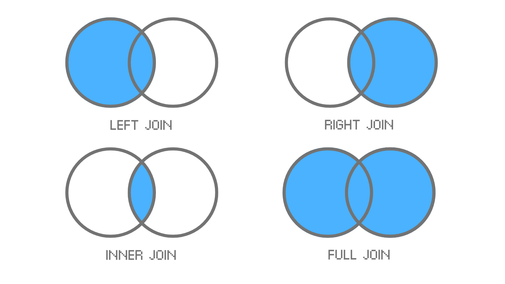

# Class 3

## Pandas continued

When you dont know how to start data exploration, begin with these commands:

- `.head()` - display the first 5 rows (default)
- `.tail()` - display the last 5 rows (default)
- `.info()` - get info on datatypes, missing data
- `.describe()` - use to look at some statistics of the data (mean, max, std, min, etc)

### Example 1

```python
import pandas as pd

# Popular mobile apps
app_data = {
  'app_name': [
    'YouTube', 'TikTok', 'Instagram', 'Spotify', 'Duolingo', 
    'Twitter', 'Headspace', 'Discord', 'Depop'
  ],
  'category': [
    'Video', 'Social Media', 'Social Media', 'Music', 'Education',
    'Social Media', 'Health', 'Communication', 'Shopping'
  ],
  'rating': [
    4.7, 4.6, 4.5, 4.6, 4.7,
    4.3, None, 4.7, 4.4
  ],
  'downloads_millions': [
    5000, 3000, 3500, 2000, None,
    1500, 500, 600, 200
  ]
}

# Create the DataFrame
apps = pd.DataFrame(app_data)
```

### Example 2

```python
import pandas as pd

# D&D characters data
characters_data = {
  'name': ['Thorne', 'Elira', 'Glim', 'Brug', 'Nyx', 'Kael', 'Mira', 'Drogan', 'Zara', 'Fenwick'],
  'race': ['Elf', 'Human', 'Gnome', 'Half-Orc', 'Tiefling', 'Dragonborn', 'Halfling', 'Dwarf', 'Aasimar', 'Goblin'],
  'class': ['Ranger', 'Cleric', 'Wizard', 'Barbarian', 'Rogue', 'Paladin', 'Bard', 'Fighter', 'Sorcerer', 'Warlock'],
  'level': [5, 3, 4, 2, 6, 7, 3, 5, 4, 2],
  'hp': [42, 28, 33, 25, 48, 56, 30, 44, 36, 24],
  'alignment': [
    'Chaotic Good', 'Lawful Good', 'Neutral', 'Chaotic Neutral', 'Chaotic Evil',
    'Lawful Neutral', 'Neutral Good', 'Neutral', 'Chaotic Good', 'Lawful Evil'
  ]
}

# Create the DataFrame
characters = pd.DataFrame(characters_data)
```

### Accessing only some columns

We can drop a column and get a new dataframe back.

```python
only_name_and_alignment_df = characters[['name', 'alignment']]
```

we can also use the `.drop()` command to remove the specified column

```python
removed_level_df = characters.drop("level", axis = 1)

```

### Filtering rows
How do we findout which apps have more than 4.5 rating?

<details>
<summary> Solution
</summary>

 ```
app_data_rating = app_data[app_data['rating'] > 4.5]

# this can be broken down into these two steps
app_data_series = app_data['rating'] > 4.5
app_data_rating = app_data[app_data_series]
 ```

</details>

if we want to combine more than one condition we can use the logical operators `and`/`or`

how do we find out which apps have a rating more than 4.5 and downloads of more than 1000 million

<details>
<summary> Solution
</summary>

 ```
popular_apps = app_data[
    (app_data['rating'] > 4.5) &
    (app_data['downloads_millions') > 1000
]

 ```

</details>

question: create a dataframe `magic_users` that contains all characters whose class is Wizard OR Sorcerer OR Warlock.

### Sorting by columns with `.sort_values()`

```
class_sorted = characters_data.sort_values(by='class', ascending=False)
```

### Rename columns with `.rename()`
```python
characters_data = characters_data.rename(columns={'race': 'background'})
```

### Adding columns
```python
# using new data
app_data['owner'] = [
    'Google', 'Bytedance', 'Zuck', 'Daniel', 'Owls', 
    'Musk', 'Headspace Health', 'Jason', 'Depop'
  ]

# using calculations
app_data['popularity'] = movies['downloads_millions'] / movies['ratings']
```

## SQL
Structured Query Language

 SQL was developed at IBM in the 70s and named SEQUEL (Structured English Query Language); you can call it “S-Q-L” or “sequel.”

 SQL databases are collections of tables, with rows and columns.

 SQL statements, or queries, are instructions that the database understands. In other words, queries allow us to retrieve information from a database.

 ```sql
 select * from samples.bakehouse.media_customer_reviews
 ```

 we can classify which columns we want

```sql
select review_date, franchiseID from samples.bakehouse.media_customer_reviews
```

### Unique values
```sql
select distinct first_name from samples.bakehouse.sales_customers
```

### Where??
what if we want to limit our query with some condition.
```sql
select distinct first_name from samples.bakehouse.sales_customers where country = 'Japan'
```

we can also use conditional operators here:
* = equal to
* != not equal to
* \> greater than
* < less than
* \>= greater than or equal to
* <= less than or equal to

how do we find all the female customers from Australia?

#### LIKE 
The LIKE operator can be used to search for a pattern in a column. It’s used in the WHERE clause:
```sql
SELECT * 
FROM samples.bakehouse.sales_customers 
WHERE first_name LIKE 'T%'; 
```
what does this do?
This statement filters the result to only include sales customers with names that begin with the letter 'T'.

The % can be used in different ways:

* `A%` matches values that begin with letter 'A'.
* `%z` matches values that end with 'z'.

how about 
```sql
SELECT * 
FROM samples.bakehouse.sales_customers 
WHERE last_name LIKE '%a%'; 
```

### Order by

The ORDER BY statement sorts rows of data in ascending or descending order. By default, this command sorts the data in ascending order.
```sql
select * 
from samples.bakehouse.sales_transactions 
order by paymentMethod

--- we can also order by descending 

SELECT paymentMethod, cardNumber 
FROM samples.bakehouse.sales_transactions
WHERE paymentMethod = 'amex'
ORDER BY quantity DESC
```

### Aggregates
Aggregate functions are used to perform calculations and return a single value.

The most common aggregate functions are:

* `COUNT()`: returns the number of rows.
* `MAX()`: returns the largest value in a column.
* `MIN()`: returns the smallest value in a column.
* `SUM()`: returns the total sum in a column.
* `AVG()`: returns the average value in a column.

Aggregate functions are used a ton with something called a GROUP BY which we will also learn later in this chapter

```sql
SELECT COUNT(*)
FROM table_name;
```
This returns the total number of rows within a table.

```sql
select sum(totalPrice) from samples.bakehouse.sales_transactions 
```
The SUM() aggregate function takes a column and returns the total sum of the values in it.

#### Group by
The GROUP BY statement groups rows of data with the same values into buckets. It’s often used with aggregate functions to group the result by one or more columns.

```sql
select product, count(*) 
from samples.bakehouse.sales_transactions 
group by product
```

```sql
select product, avg(quantity) 
from samples.bakehouse.sales_transactions 
group by product
```

```sql
select paymentMethod, avg(totalPrice) 
from samples.bakehouse.sales_transactions 
group by paymentMethod
```

### Creating Tables
We’ve been retrieving data from SQL tables left and right, but where do SQL tables come from?

They don’t just fall from the sky. Someone has to create the tables for Data Analysts and Data Scientists to pull data from.

```sql
CREATE TABLE companies (
  id INTEGER,
  name TEXT,
  headquarters TEXT,
  year INTEGER
);
```
we are creating a new table of companies with the following columns:

* id column of the data type INTEGER.    
* name column of the data type TEXT.    
* headquarters column of the data type TEXT.   
* year column of the data type INTEGER

#### Datatypes
these are some most common types:      
* TEXT: a text string.
* INTEGER: a positive or negative whole number.
* REAL: a positive or negative decimal number. 
* DATE: a date format (YYYY-MM-DD).

### Inserting data

When you create a new table, it’s empty. Now, time to add some rows to it!
```sql
INSERT INTO companies (id, name, headquarters, year)
VALUES (1, 'Twitter', 'San Francisco', 2006);
```

whats happening here

* `INSERT INTO` is a clause that adds the specified row.   
* `companies` the name of the table the row is being added to.   
* `(id, name, headquarters, year)` is a parameter with the column names that data will be inserted to.   
* `VALUES` clause indicates the data being inserted.    
* `(1, 'Twitter', 'San Francisco', 2006)` are the values.   
After using this statement, there'll be be a new row in companies where:

* `id` is 1     
* `name` is 'Twitter'         
* `headquarters` is 'San Francisco'    
* `year` is 2006

we can add multiple rows
```sql
INSERT INTO companies (id, name, headquarters, year)
VALUES (1, 'Twitter', 'San Francisco 🌁', 2006);

INSERT INTO companies (id, name, headquarters, year)
VALUES (2, 'Duolingo', 'Pittsburgh 🐝', 2011);

INSERT INTO companies (id, name, headquarters, year)
VALUES (3, 'BeReal', 'Paris 🇫🇷', 2020);

INSERT INTO companies (id, name, headquarters, year)
VALUES (4, 'MongoDB', 'New York 🗽', 2009);
```

### Alter table
what if we wanna add a new column
```sql
ALTER TABLE companies
ADD COLUMN about TEXT;
```
### UPDATE
```sql
UPDATE companies
SET name = 'X'
WHERE name = 'Twitter';

--- we can use a different column in where

UPDATE companies
SET headquarters = 'Brooklyn 🌉'
WHERE id = 4;
```

### DELETE FROM
when we need to delete rows
```sql
DELETE FROM companies
WHERE name = 'BeReal';
```

### Joins
a table does not usually exist by itself. it has other tables that it interacts or "joins" with.

A join lets us combine rows from two or more tables, based on a related column.

There are several types of joins in SQL, each serving a different purpose:

JOIN    
LEFT JOIN   
RIGHT JOIN      
FULL JOIN       
UNION       



```sql
--- inner join

SELECT columns
FROM table1
JOIN table2
  ON table1.column1 = table2.column2;
```

#### Left Join

So we just learned the regular `JOIN / INNER JOIN`, but what if we want to combine two tables and keep some of the un-matched rows?

A `LEFT JOIN`, also known as the `LEFT OUTER JOIN`, will keep all rows from the left table, plus matched rows in the right table.

```sql
SELECT columns
FROM table1
LEFT JOIN table2
  ON table1.column1 = table2.column2;
```

So what’s the difference between JOIN and LEFT JOIN?

JOIN:

* Returns rows where there’s a match in both tables.      
* If there’s no match, that row is excluded.      

LEFT JOIN:

* Returns all rows from the left table, and matched rows from the right.      
* If there’s no match on the right, you’ll still get the left row... but with NULLs for the right-side columns.       

#### UNION

The UNION operator in SQL combines two tables into one list, without duplicates.

```sql
SELECT columns
FROM table1
UNION
SELECT columns
FROM table2;
```
