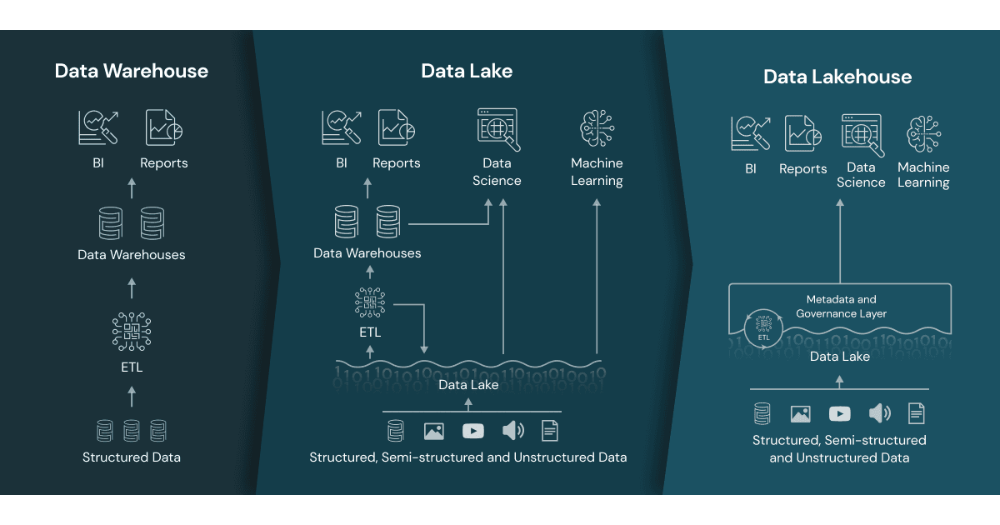
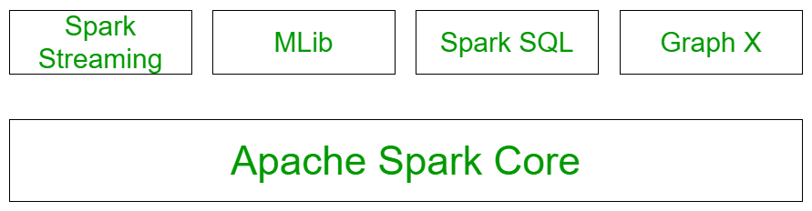

# Class 4

## Tables 
Rows and columns

## Database
Collection of tables and other entities

## ETL 
The process of extracting data from source systems, transforming the data and then loading the data into the data warehouse is called ETL (extract, transform, load).

## Data Warehouse
[Data Warehouse](https://www.databricks.com/discover/data-warehouse) is a data management system that stores current and historical data from multiple sources in a business-friendly manner for easier insights and reporting.
It is not suited or were expensive for handling unstructured data, semi-structured data, and data with high variety, velocity, and volume.

## Data Lake
[Data lake](https://www.databricks.com/discover/data-lakes) handles raw data in a variety of formats on cheap storage for data science and machine learning, though lacked critical features from the world of data warehouses: they do not support <b>transactions</b>, they do not enforce data quality, and their lack of consistency/isolation makes it almost impossible to mix appends and reads, and batch and streaming jobs.

## Data Lakehouse
A [data lakehouse](https://www.databricks.com/glossary/data-lakehouse) is a new, open data management architecture that combines the flexibility, cost-efficiency, and scale of data lakes with the data management and ACID transactions of data warehouses, enabling business intelligence (BI) and machine learning (ML) on all data.
Metadata layers, like the open source Delta Lake, sit on top of open file formats (e.g. Parquet files) and track which files are part of different table versions to offer rich management features like ACID-compliant transactions.

What is the real difference?


## Medallion Architecture
### Bronze
where we land all the data from external source systems. The table structures in this layer correspond to the source system table structures "as-is," along with any additional metadata columns that capture the load date/time, process ID, etc

### Silver
In the Silver layer of the lakehouse, the data from the Bronze layer is matched, merged, conformed and cleansed ("just-enough") so that the Silver layer can provide an "Enterprise view" of all its key business entities, concepts and transactions. (e.g. master customers, stores, non-duplicated transactions and cross-reference tables).

### Gold
Data in the Gold layer of the lakehouse is typically organized in consumption-ready "project-specific" databases. The Gold layer is for reporting and uses more de-normalized and read-optimized data models with fewer joins

https://www.databricks.com/glossary/medallion-architecture

# Big Data
Big data - study and application of data sets that are too complex to handle with traditional data processing softwares.
3Vs of big data are volume, velocity, and variety. Volume refers to the size of data. Variety refers to different sources and formats of data. Velocity is the speed at which data is generated and available for processing.

## Concepts
* Clustered computing is the pooling of resources of multiple machines to complete jobs. 
* Parallel computing is a type of computation in which many calculations are carried out simultaneously. 
* A distributed computing involves nodes or networked computers that run jobs in parallel. 
* Batch processing refers to the breaking data into smaller pieces and running each piece on an individual machine. 
* Real-time processing demands that information is processed and made ready immediately.

## Processing Frameworks
Hadoop/MapReduce framework - is open source and scalable framework for batch data.

Apache Spark - is a parallel framework for storing and processing of Big Data across clustered computers. It is also open source and is suited for both batch and real-time data processing.

## Apache Spark
Spark distributes data and computation across multiple computers executing complex multi-stage applications such as machine learning.   
Spark runs most computations in memory and thereby provides better performance for applications such as interactive data mining.  
Spark helps to run an application up to 100 times faster in memory, and 10 times faster when running on disk. Spark supports Scala, Java, Python, R, and SQL.



### Modes
Local mode  
Cluster mode


https://spark.apache.org/docs/latest/img/cluster-overview.png

```

 print("The version of Spark Context in the PySpark shell is", spark.version)
 df = spark.table('samples.accuweather.forecast_daily_calendar_imperial')
 display(df)

```

### RDD
RDD stands for Resilient Distributed Datasets. It is simply a collection of data distributed across the cluster. RDD is the fundamental and backbone data type in PySpark. When Spark starts processing data, it divides the data into partitions and distributes the data across cluster nodes, with each node containing a slice of data.  
Resilient - ability to withstand failures and recompute missing or damaged partitions.   
Distributed - spanning the jobs across multiple nodes in the cluster for efficient computation.   
Datasets - a collection of partitioned data e.g. Arrays, Tables, Tuples or other objects.

Create a DataFrame - built on top of RDD

```
df_children = spark.createDataFrame(
  data = [("Mikhail", 15), ("Zaky", 13), ("Zoya", 8)],
  schema = ['name', 'age'])
display(df_children)
```

specify schema types
```
from pyspark.sql.types import StructType, StructField, StringType, IntegerType

df_children_with_schema = spark.createDataFrame(
  data = [("Mikhail", 15), ("Zaky", 13), ("Zoya", 8)],
  schema = StructType([
    StructField('name', StringType(), True),
    StructField('age', IntegerType(), True)
  ])
)
display(df_children_with_schema)
```

reading from a csv file loaded into databricks volumes
```
df_csv = (spark.read
  .format("csv")
  .option("header", True)
  .option("inferSchema", True)
  .load('/Volumes/workspace/default/data-eng/listings.csv')
)
display(df_csv)
```

we can use the databricks filesytem command to see the file
```
%fs ls dbfs:/Volumes/workspace/default/data-eng/listings.csv
```

#### operations on RDD
select columns
```
from pyspark.sql.functions import col

display(df_csv.select(
  col("name"),
  col("host_name")
))

display(df_csv.select(
    'name', 
    'host_name'
    ))
```

add a column 
```
df_popular_flag = df_csv.withColumn("popular", col("number_of_reviews").cast("int") > 100)
display(df_popular_flag)
```
what is the problem? we need to clean the data
```
df_clean = df_csv.filter(
  col("number_of_reviews").rlike("^[0-9]+$")
)
df_popular_flag = df_clean.withColumn("popular", col("number_of_reviews").cast("int") > 100)
display(df_popular_flag)
```
remove column
```
df_popular_flag.drop('popular')
```

exercise: 
create example code for
1. filter rows from the listing dataset : [help link](https://docs.databricks.com/aws/en/pyspark/basics#filter-rows)
2. remove duplicate rows : [help link](https://docs.databricks.com/aws/en/pyspark/basics#remove-dupes)
3. drop null values : [help link](https://docs.databricks.com/aws/en/pyspark/basics#handle-nulls)

##### saving data as a table
```
catalog_name = 'workspace'
schema_name = 'default'
table_name = 'listings_popular'
df_popular_flag.write.saveAsTable(f"{catalog_name}.{schema_name}.{table_name}")
```

##### save as csv file
```
file_path = "dbfs:/Volumes/workspace/default/data-eng/"

(df_popular_flag.write
  .format("csv")
  .mode("overwrite")
  .write(file_path)
)
```